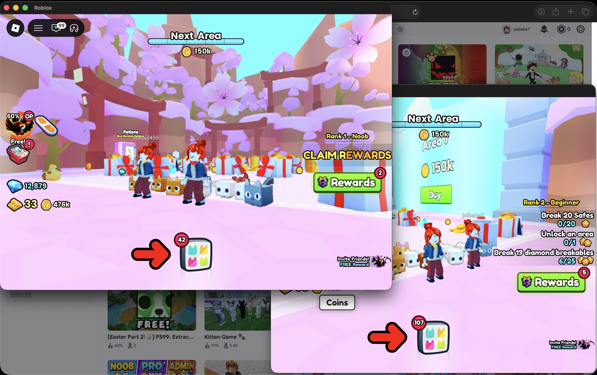

# multi-roblox-macos

Run multiple [Roblox](https://www.roblox.com) players at the same time on macOS, one per browser account, with teleport between places still working.

## Demo

Two Roblox clients running simultaneously on macOS:



## Overview

`multi-roblox-macos` is a small native macOS launcher. It registers itself as the OS handler for the `roblox-player://` URL scheme, so every "Play" click on roblox.com is delivered to this app. For each deeplink, it clones `/Applications/Roblox.app` into a unique temp directory, patches the copy so Launch Services does not refuse it, and opens the copy. Closing the launcher removes the clones.

Roblox's own `RobloxPlayer.app` declares `LSMultipleInstancesProhibited = true`, which makes Launch Services refuse to start a second copy. The work-around is to clone the bundle, edit the clone's `Info.plist`, and destroy Roblox's named semaphore so the new copy believes no other player is running.

The codebase is Go, with a small Objective-C bridge for the Cocoa UI and the `kAEGetURL` Apple Event handler. There is no Xcode project, no CocoaPods, and no Swift.

## Credits

This project is based on the original work by Insadem.

Original repository:
<https://github.com/Insadem/multi-roblox-macos>

This fork focuses on restoring compatibility with modern macOS versions, fixing a startup crash introduced by an outdated Cocoa wrapper, improving error handling and shutdown safety, and adding professional documentation, CI, and release tooling. The original MIT license and attribution are preserved.

## Features

- **Multiple Roblox instances.** Each deeplink spawns a fresh copy, isolated from the others.
- **Apple Silicon support.** Builds and runs natively on arm64.
- **Intel support.** Builds and runs on x86_64.
- **Universal binary.** `./build.sh universal` produces a single fat binary.
- **Native macOS app.** Small Cocoa window with two buttons. No browser, no Electron.
- **Automatic Roblox cloning.** Every deeplink spawns a fresh clone. An auto-updated Roblox is picked up on the next click.
- **Teleport support.** Teleport deeplinks are routed through the same `roblox-player://` handler.

## Installation

### Requirements

- A Mac running a recent version of macOS (see [Compatibility](#compatibility))
- [Go 1.23+](https://go.dev/dl/) — only required when building from source
- Xcode Command Line Tools (`xcode-select --install`) — required for cgo against AppKit

### Clone

```sh
git clone https://github.com/kushangshah/multi-roblox-macos.git
cd multi-roblox-macos
```

### Build

```sh
# Native build for the architecture you are running on
./build.sh

# Or a universal (arm64 + amd64) bundle
./build.sh universal
```

The script writes the binary into `multiroblox.app/Contents/MacOS/multi-roblox-macos`.

### Run

```sh
open multiroblox.app
```

A small window titled "multi-roblox-macos" appears. Leave it running.

To start a Roblox game, go to [roblox.com](https://www.roblox.com) in your browser, sign in to the account you want to play, and click any "Play" button. The browser hands the deeplink to this app, which spawns a new instance.

To start a second instance, switch to a different browser account (or use a different browser profile) and click Play again. Repeat as needed.

To stop every running Roblox process, click **close all instances** in the multi-roblox-macos window.

### Uninstall

1. Quit the multi-roblox-macos window.
2. Drag `multiroblox.app` to the Trash.
3. (Optional) Remove leftover temp directories:

   ```sh
   rm -rf "$TMPDIR"/multi-roblox-*
   ```

   These are normally cleaned up automatically on quit, but a hard kill of the app can leave a few behind.

The app does not install any daemons, login items, or kernel extensions.

## Usage

```sh
./build.sh           # build for current arch
open multiroblox.app # run the app
```

Then:

1. Click **Play** on roblox.com under account A. The first Roblox instance starts.
2. Switch to account B in the same browser, or use a different browser profile.
3. Click **Play** again. A second, independent instance starts.
4. Use teleport as normal; it still works.

To terminate every running Roblox process, click **close all instances** in the multi-roblox-macos window.

## How it works

When you click "Play" on roblox.com, the browser asks the OS to open a `roblox-player://...` URL. By default, macOS routes that URL to `RobloxPlayer.app`, which refuses to start a second copy.

This app registers itself as the default handler for the `roblox-player://` scheme. macOS now hands every deeplink to multi-roblox-macos instead.

For each deeplink:

1. A unique subdirectory is created in `$TMPDIR` via `os.MkdirTemp`.
2. `/Applications/Roblox.app` is recursively copied (`cp -a`) into that directory.
3. The named semaphore `/RobloxPlayerUniq` — which Roblox uses to detect an already-running player — is destroyed via `sem_unlink`.
4. The copy is opened with `open -a`.
5. After launch, the copy's `Info.plist` is patched to set `LSMultipleInstancesProhibited = false`, so the next deeplink is not blocked.
6. On quit, every copy is removed (`os.RemoveAll`).

The `kAEGetURL` Apple Event that delivers the deeplink is installed via a small Objective-C bridge in `internal/deeplink/`. The Cocoa UI window is installed via a small Objective-C bridge in `internal/macosapp/`.

## Compatibility

| Component | Versions tested by the maintainer |
|---|---|
| macOS | 26 Tahoe (Apple Silicon) |
| Architecture | arm64 |
| Go | 1.23, 1.26 |

The app links against AppKit and Launch Services, both of which are available on macOS 10.13 High Sierra and newer, and against `NSWorkspace.URLForApplicationToOpenURL:`, which is available on macOS 10.6 and newer. Compatibility with other recent macOS versions and with Intel hardware is expected, but has not been verified by the maintainer. Community testing is welcome — please open an issue with your hardware, macOS version, and result.

## Troubleshooting

### Window doesn't appear

- Confirm the binary exists: `ls -la multiroblox.app/Contents/MacOS/multi-roblox-macos`.
- Try launching the binary directly from a terminal to see error output:
  ```sh
  ./multiroblox.app/Contents/MacOS/multi-roblox-macos
  ```
- Make sure no older copy of the app is still running. Use Activity Monitor and search for `multi-roblox-macos`.

### Roblox doesn't launch

- Confirm Roblox is installed: `ls /Applications/Roblox.app`. If it is not, install Roblox from [roblox.com](https://www.roblox.com).
- macOS only allows one app at a time to own a URL scheme. If Roblox itself owns `roblox-player://`, this app re-registers itself on every deeplink. If launching still fails, quit and reopen the multi-roblox-macos window.

### Only one Roblox instance launches

- Some browser extensions intercept `roblox-player://` URLs and route them to the original Roblox app. Disable extensions on roblox.com, or try a different browser.
- If a previous Roblox process is hung, click **close all instances** to terminate it, then try again.

### Permissions

- This app does not require Full Disk Access, Accessibility, or any other macOS privacy permission. It only writes to `$TMPDIR` and to copies of `Roblox.app` it owns.

### Gatekeeper / "unidentified developer"

- On the first run, macOS may refuse to open the app because it is not notarized. Right-click (or Control-click) the app, choose **Open**, then click **Open** in the dialog.
- For a permanent fix without right-clicking, strip the quarantine attribute:
  ```sh
  xattr -cr multiroblox.app
  ```

### Code signing

- This repository does not ship signed binaries. If you want to distribute a build that survives Gatekeeper without the `xattr` workaround, sign it with your own Developer ID:
  ```sh
  codesign --force --deep --options runtime \
    --sign "Developer ID Application: Your Name (TEAMID)" \
    multiroblox.app
  ```
- See [`.github/workflows/release.yml`](.github/workflows/release.yml) for a complete release workflow.

## Developer

### Project structure

```
.
├── main.go                          # entry point, deeplink dispatch loop
├── build.sh                         # native and universal build script
├── go.mod / go.sum                  # Go module manifest
├── docs/
│   └── images/                      # screenshots used in the README
├── multiroblox.app/                 # the .app bundle
│   └── Contents/
│       ├── Info.plist               # registers the roblox-player:// scheme
│       ├── MacOS/                   # the compiled binary lives here
│       └── Resources/AppIcon.icns   # app icon
├── internal/
│   ├── deeplink/                    # kAEGetURL Apple Event bridge (Obj-C)
│   ├── infoplist/                   # Info.plist editor (LSMultipleInstancesProhibited)
│   ├── macosapp/                    # Cocoa window + run loop (Obj-C)
│   ├── robloxapp/                   # Roblox.app cloning, close-all, open
│   ├── syncbreaker/                 # sem_unlink("/RobloxPlayerUniq")
│   └── urlhandler/                  # Launch Services / NSWorkspace wrapper
├── pkg/
│   ├── fspath/                      # Path + TMPDir helpers
│   └── ps/                          # cross-platform process table reader
├── scripts/
│   └── build-dmg.sh                 # DMG creation
└── .github/
    ├── workflows/                   # CI and release
    └── RELEASE_NOTES/               # per-version release notes
```

### Building

- `./build.sh` — native build for the host arch
- `./build.sh universal` — fat binary with arm64 and amd64

### Running tests

```sh
go test ./...
```

Unit tests live next to the code they cover (`*_test.go`). Integration tests under `internal/robloxapp/` require `/Applications/Roblox.app` to be installed; they are skipped in CI.

### Building a DMG

```sh
brew install create-dmg
./scripts/build-dmg.sh
```

The output is `dist/multi-roblox-macos-<version>.dmg`. See [`.github/workflows/release.yml`](.github/workflows/release.yml) for the full signed-and-notarized release flow.

### Contributing

See [CONTRIBUTING.md](CONTRIBUTING.md).

## License

This project is released under the MIT License. See [LICENSE](LICENSE).
